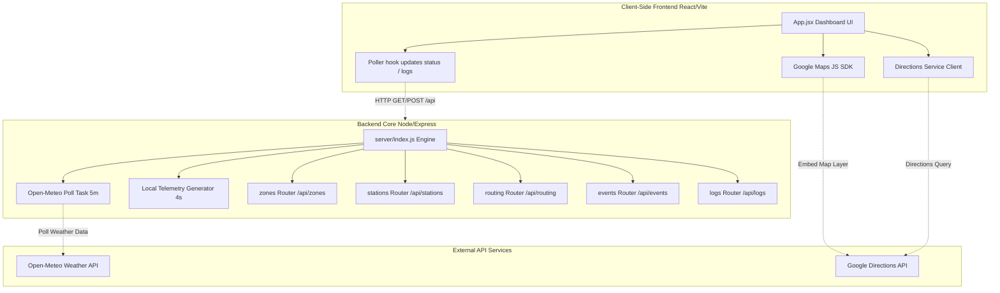

# 🏙️ Bhopal Tatkal Mamla

**Bhopal Tatkal Mamla** is a premium, next-generation urban monitoring dashboard and comfort-focused route optimizer designed specifically for the city of Bhopal, India. 

Standard navigation apps focus purely on finding the fastest path, often leading commuters through congested bottlenecks and extreme sun exposure. In Indian summers or major sporting events, this exposes commuters to severe heatwaves and traffic grids. This platform introduces **Comfort Routing** and **Real-Time Telemetry Tracking** to solve this problem by synthesizing traffic densities, thermal zones, and event-driven transit redirects into an actionable cyberpunk-styled control room dashboard.

---

## 🏗️ System Architecture

The project is designed using a decoupled, high-performance **MERN-lite** architecture:



### 1. Frontend Client (`/client`)
Built with **React 18** and **Vite** for ultra-fast bundling and Hot Module Replacement (HMR).
*   **Styling**: Powered by **Tailwind CSS v4** featuring custom design tokens, animations, glassmorphism panel styles, and a modern dark theme custom palette (curated HSL colors, cyan/red neon glows, and custom typography).
*   **Google Maps Integration**: Dynamically loads the Google Maps JavaScript API via the client configuration. It overlays interactive map themes, traffic heatmap layers, and handles Directions polyline rendering.
*   **Offline Fallback Mode**: When the Express server is offline, the client automatically executes local simulator loops to fake sensor fluctuations and console feeds, ensuring the dashboard remains visually alive and testable.

### 2. Backend Server (`/server`)
An **Express** server serving as the telemetry ingestion core.
*   **API Gateways**: Exposes endpoints for zone telemetry, station flow metrics, routing profiles, event statuses, system logs, and security/API configuration keys.
*   **Active Weather Telemetry (Open-Meteo API Sync)**: An automated background task fetches live temperature readings for Bhopal's coordinates (TT Nagar, MP Nagar, and Bhopal Junction) every 5 minutes. If a threshold of 40°C is breached, it raises an "Extreme Heat" warning. If 38°C is reached, it sets an "Elevated Warning".
*   **Sensor Ingestion & Event Simulation Loop**: Generates updates every 4 seconds to simulate dynamic station flow rates (`pax/min`), system logs, and slight temperature fluctuations if the remote API fails.

---

## 📁 Repository Structure

```
bhopalTatkal/
├── client/                     # Frontend Application
│   ├── src/
│   │   ├── components/
│   │   │   └── Navbar.jsx      # Navigation header placeholder
│   │   ├── App.jsx             # Core dashboard visual interface & logic
│   │   ├── index.css           # Tailwind CSS v4 design tokens and utilities
│   │   └── main.jsx            # Entry point for React DOM rendering
│   ├── package.json            # Client dependencies (React, Google Maps helpers)
│   ├── vite.config.js          # Vite configurations
│   └── .env.example            # Client env structure template
├── server/                     # Backend Application
│   ├── routes/
│   │   ├── events.js           # Special Event / Cricket Mode status management
│   │   ├── logs.js             # Central logs ingestion/dissemination
│   │   ├── routing.js          # Fallback comfort-routing engine
│   │   ├── stations.js         # Transit hub density and flow rate tracker
│   │   └── zones.js            # Thermal telemetry sensor store
│   ├── index.js                # Core entry point, schedulers, and configuration endpoints
│   ├── package.json            # Server dependencies (Express, CORS, Dotenv)
│   └── .env.example            # Server env structure template
├── PRESENTATION.md             # Slides outline and key features presentation guide
└── README.md                   # System documentation (This file)
```

---

## 🌟 Key Premium Features

*   **Comfort Routing Engine**: Integrates the Google Directions Service client-side to calculate transit routes. Commuters can choose "Speed" (fastest, high congestion, no canopy) or "Comfort" (shaded boulevard routes, lake bypass, cooler microclimate, and low crowds).
*   **Live Weather Sync**: Fetches actual temperatures dynamically for Bhopal. If the Weather API fails, the backend switches to a fallback simulation model.
*   **Google Maps Traffic Heatmap Layer**: Commuters can toggle the map mode to "Heatmap" to render Google's active traffic density layer (green, yellow, red congestion) directly on street corridors.
*   **Cricket Mode (Special Event Redirection)**: When active, the system focuses telemetry on Aishbagh Stadium. It logs scan rates, congestion flags, shuttle delays, and directs unnecessary traffic away from the match venue.
*   **Live Terminal Console**: An interactive logging console tracking real-time municipal sensor updates, route dispatches, and climate warning alarms.

---

## 🛠️ Quick Start

### Prerequisites
*   [Node.js](https://nodejs.org/) (v18 or higher recommended)
*   [Google Maps API Key](https://developers.google.com/maps/gmp-get-started) (Optional: the application will fallback to simulated development maps if no key is provided)

### Step 1: Clone and Configure Backend
1. Go to the `server/` directory:
    ```bash
    cd server
    ```
2. Install dependencies:
    ```bash
    npm install
    ```
3. Create a `.env` file based on `.env.example`:
    ```bash
    cp .env.example .env
    ```
4. Define your keys in `.env`:
    ```env
    PORT=5000
    GOOGLE_MAPS_API_KEY=your_google_maps_api_key_here
    ```
5. Spin up the server:
    ```bash
    npm start
    ```
    The backend runs on `http://localhost:5000` by default. You can test health at `http://localhost:5000/api/health`.

### Step 2: Configure and Start Frontend
1. Go to the `client/` directory:
    ```bash
    cd ../client
    ```
2. Install dependencies:
    ```bash
    npm install
    ```
3. Create a `.env` file based on `.env.example`:
    ```bash
    cp .env.example .env
    ```
4. Set the API variable to point to your backend:
    ```env
    VITE_API_URL=http://localhost:5000
    ```
5. Start the development server:
    ```bash
    npm run dev
    ```
    Open the server link in your browser (typically `http://localhost:5173`).

---

## 🔌 API Endpoints Reference

| Method | Endpoint | Description |
|---|---|---|
| **GET** | `/api/health` | Diagnostic endpoint checking server status. |
| **GET** | `/api/config` | Retrieves public configurations, such as the Google Maps SDK API key. |
| **GET** | `/api/zones` | Fetches active thermal readings for Alpha, Beta, and Gamma coordinates. |
| **PUT** | `/api/zones/:id` | Modifies zone status/temperatures (admin/municipal simulator). |
| **GET** | `/api/stations` | Retrieves passenger flow rates (`pax/min`) for primary transit hubs. |
| **POST** | `/api/stations/:id/flow` | Ingests new passenger density readings from sensors. |
| **POST** | `/api/routing/calculate` | Calculates route details, incident sheets, and directional steps. |
| **GET** | `/api/events/cricket` | Gets matchday gate congestion, shuttle status, and redirection flags. |
| **POST** | `/api/events/toggle` | Activates/Deactivates Cricket Mode. |
| **GET** | `/api/logs` | Returns the history of the 50 most recent system alerts and telemetry events. |
| **POST** | `/api/logs` | Publishes a new municipal alert entry to the central console. |

---

## 🚀 Deployment

*   **Backend Hosting**: Recommended for [Render](https://render.com) using standard Node environment variables. Ensure the `GOOGLE_MAPS_API_KEY` is set in the Render environment variables dashboard.
*   **Frontend Hosting**: Recommended for [Netlify](https://www.netlify.com) or [Vercel](https://vercel.com). Configure the `VITE_API_URL` environment variable to point to your deployed backend URL.
